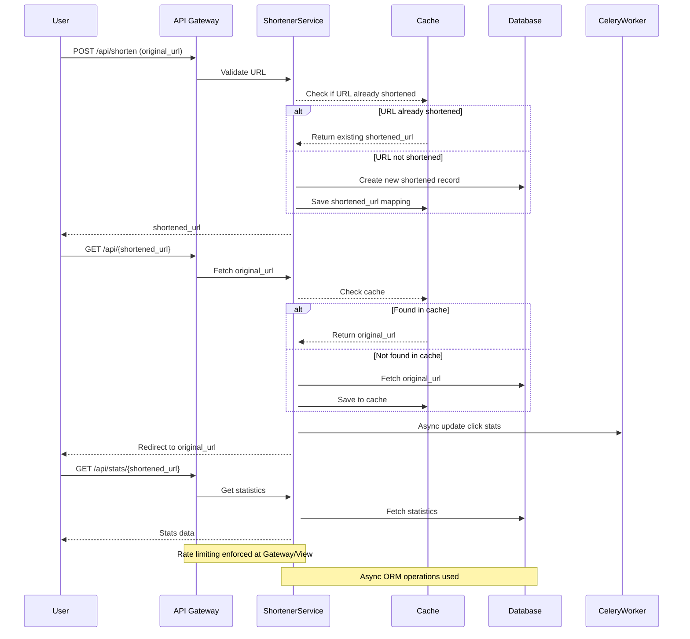

# Async URL Shortener 

A **highly scalable**, fully **asynchronous URL shortener** built with **Django**, **Celery**, **Redis**, and **PostgreSQL**.  
Designed to efficiently handle high traffic using caching and background tasks to minimize database load and optimize performance.

---

## Features ✨

-  Asynchronous URL shortening
-  Retrieve original URLs from shortened links
-  Track URL usage statistics (click counts)
-  Rate limiting to prevent abuse
-  Caching layer using Redis
-  Background tasks with Celery
-  Full Docker support for easy setup
-  Testing using Django pytest
-  Optimized for scalability and performance

---

## Technologies Used 🛠

- Django 4.x (Async views support)
- Django REST Framework (DRF)
- Celery 5.x
- Redis (Cache + Message Broker)
- PostgreSQL
- Uvicorn / Gunicorn (ASGI Servers)
- Docker + Docker Compose

---

## Docker Architecture Diagram 

```plaintext
+-------------+    +--------------+    +------------+
|   Web App   |<-->|     Redis     |<-->|   Celery    |
| (Django App)|    |(Cache+Broker) |    |  (Worker)   |
+-------------+    +--------------+    +------------+
       |
       v
+-------------+
|    DB       |
| (PostgreSQL)|
+-------------+
```

---

## Workflow - Sequence Diagram



---

## Project Structure 📂

```bash
src/
├── middlewares/
│        └── rate_limit.py       #Custom middleware
├── url_shortener/
│   ├── application/
│   │   └── url_service.py       # Business logic
│   ├── infrastructure/
│   │   └── url_repository.py    # Database and cache handling
│   ├── events/
│   │   └── tasks.py             # Celery background tasks
│   └── Interfaces/              #API endpoint and url
|   │    └── views.py 
|   │    └── urls.py  
|   │    └── serilizers.py  
|   └── models.py                 #Database model
├── tests/  
|     └── test_url_shortener.py            
├── config/                       #Django and celery sittings                  
├── manage.py
├── Dockerfile
├── pytest.ini
├── docker-compose.yml
├── requirements.txt
└── README.md
```

---

## Installation 

### Prerequisites

- Docker and Docker Compose installed
- Ports `8000`, `6379`, and `5432` available

### Quick Start (Docker)

Clone the repository:

```bash
git clone https://github.com/SaaaRoO/url_shortener/tree/develope
cd async-url-shortener
```

Copy environment variables:

```bash
cp .env .env
```

Build and start containers:

```bash
docker-compose up --build
```

Access:

- Django App: [http://localhost:8000/](http://localhost:8000/)
- Celery Worker: Started automatically
- Redis and PostgreSQL: Auto-configured

---

## API Endpoints 

| Method | Endpoint | Description |
|:------:|:--------:|:-----------:|
| POST | `/api/create/` | Shorten an original URL |
| GET  | `/api/<str:short_code>/` | Retrieve and redirect |
| GET  | `/api/<str:short_code>/stats/` | Get usage statistics |

---

## Example Requests

### create a short  URL

**Request:**
```http
POST /api/create/
Content-Type: application/json
{
    "original_url": "https://www.example.com/very/long/url"
}
```

**Response:**
```json
{
    "original_url": "https://www.example.com/very/long/url",
    "shortened_url": "http://localhost:8000/cwn1JO",
    "short_code": "cwn1JO"
}
```


### Redirect from Shortened URL

**Request:**
```http
GET /api/cwn1JO/
```

**Behavior:** "original_url": "https://www.example.com/very/long/url"


### URL Statistics

**Request:**
```http
GET /api/cwn1JO/stats/
```

**Response:**
```json
{
    "short_code": "cwn1JO",
    "original_url": "https://www.example.com/very/long/url",
    "shortened_url": "http://localhost:8000/cwn1JO",
    "created_at": "2025-04-29T20:52:57.999122Z",
    "last_accessed": "2025-04-29T20:55:47.102543Z",
    "access_count": 1,
    "is_active": true
}
```

---

## Environment Variables 

Create a `.env` file based on `.env`:

```bash
# PostgreSQL settings
POSTGRES_DB=url_shortener_db
POSTGRES_USER=postgres
POSTGRES_PASSWORD=postgres
POSTGRES_HOST=db
POSTGRES_PORT=5432

# Redis
REDIS_URL=redis://redis:6379/0

# Django settings
DJANGO_SECRET_KEY="(9(f@nv*lltx1^b8di#mmha)qr2)9)+5&ao24*=6o-g2*xa-w-"
DJANGO_ALLOWED_HOSTS=localhost 127.0.0.1
```

---

## Running Celery Worker 🚀

If you want to run it manually:

```bash
docker-compose exec web celery -A src.config worker --loglevel=info
```

---

## Caching Strategy

- Redis is checked before hitting the database.
- URLs and click counters are cached in Redis for faster reads.
- Heavy operations (like updating click stats) are handled asynchronously with Celery.

---

## Rate Limiting

- Protects APIs from abuse.
- Can be enforced using Django Ratelimit or custom middleware.
- Example: Allow max 100 shortenings per IP per hour.

---

## Testing 

- inside Docker container run:

```bash
docker-compose run --rm web pytest -v
```


> **Made with ❤️ for high performance and scalability.**

